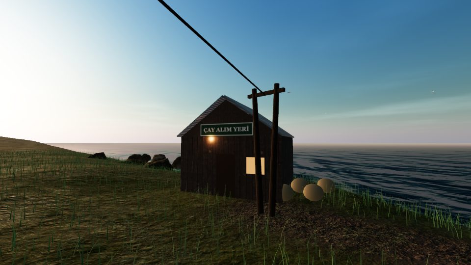
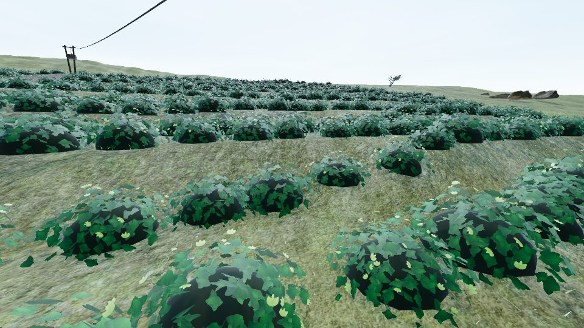
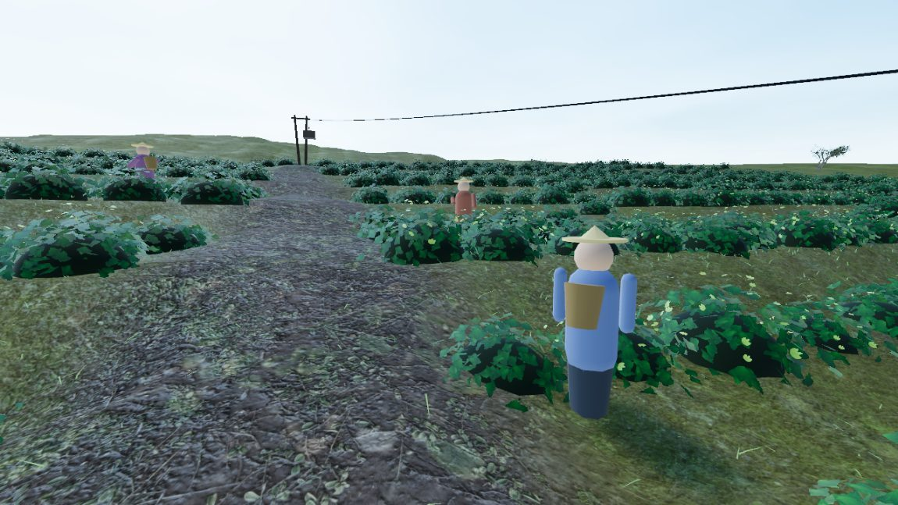
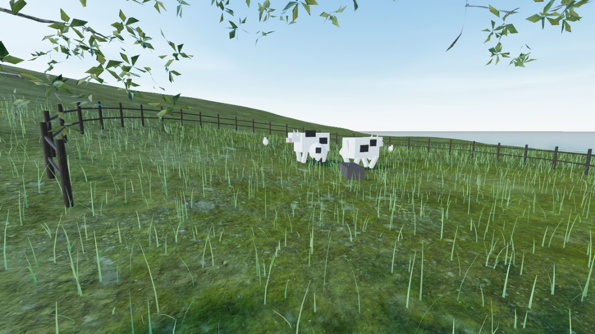
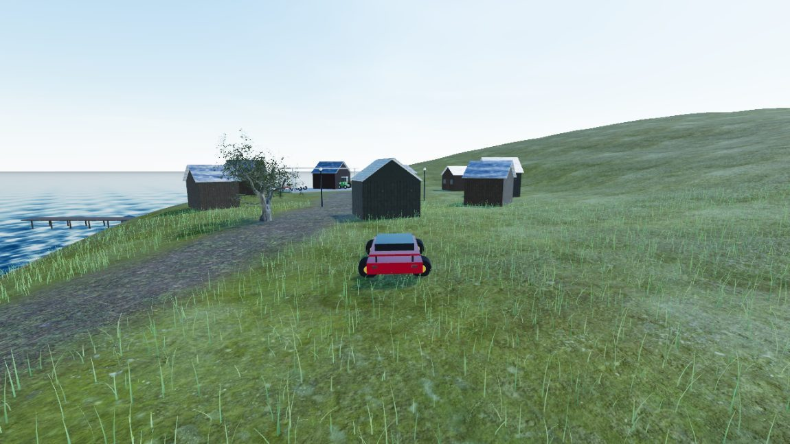

# 🍃 Çay Vadisi — Teetal am Schwarzen Meer

Ein First-Person-Farm- und Management-Spiel im Browser: Du führst einen
Teegarten an der türkischen Schwarzmeerküste (Karadeniz). Pflücke frische
Triebe nach der echten Regel **„iki yaprak bir tomurcuk"** (zwei Blätter, eine
Knospe), stelle Arbeiter ein, baue Gemüse an, halte Tiere, verkaufe auf dem
Wochenmarkt — und arbeite dich vom Teepflücker zum **Çay-Baron** hoch, mit
Traktor, Pickup und am Ende dem Sportwagen mit Goldfelgen.

Gebaut mit **three.js** (Vanilla, kein Framework, kein Build-Schritt).
Komplett zweisprachig: **Deutsch / Türkçe**. Spielbar am Desktop **und am
Smartphone** (virtueller Joystick, Touch-Pedale).



| | |
| --- | --- |
|  |  |
|  |  |

## Spielen

Beliebigen statischen Webserver im Projektordner starten, z. B.:

```bash
python -m http.server 8137
```

Dann `http://localhost:8137` öffnen. Kein Build, keine externen CDNs —
alles liegt im Repo (offline lauffähig, direkt hostbar auf jedem Webspace).

## Steuerung

| Eingabe | Aktion |
| --- | --- |
| `W A S D` | Laufen / Fahren |
| Maus | Umsehen (Klick ins Bild aktiviert Mauslock) |
| Linksklick **halten** | Tee pflücken |
| `E` | Benutzen: Verkaufen, Schlafen, Seilbahn, Ein-/Aussteigen, Ernten, Hof/Markt/Autohaus |
| `Tab` | Betriebs-Panel (Arbeiter · Lager · Bilanz) |
| `P` | Privatleben (Profil · Familie · Immobilien · Börse) |
| `M` | Minimap ein/aus |
| `N` | 📱 ÇayFon-Telefon (Wetter · Taxi · Bank · Dekrete …) |
| `V` | First-/Third-Person-Ansicht |
| `H` | Hupe (im Fahrzeug) |
| `Leertaste` | Handbremse / Drift (im Fahrzeug) |
| `T` | Wheelie (auf der Moto) |
| `R` | Radio (im Fahrzeug/Boot) |
| 🎮 | Gamepad: Sticks bewegen/umsehen, Trigger Gas/Bremse, A benutzen, Y Ansicht |
| `Shift` | Rennen |
| `Esc` | Pause |

Touch-Geräte: virtueller Joystick links = Laufen, Ziehen rechts = Umsehen,
Finger auf Busch halten = Pflücken, Aktions-Prompt antippen = Benutzen.
Im Fahrzeug: Joystick lenkt, ▲/▼-Pedale geben Gas und bremsen.

## Spielmechanik

### Teegarten
- **Wachstum:** Triebe sprießen über den Tag; nach **Regen** doppelt so schnell.
- **Qualität:** Frische Triebe = voller Preis (★). Wer zu lange wartet, pflückt
  überständige Blätter (weniger wert). Bei Regen gepflückt = leichter Abschlag.
- **Tagesauftrag:** Jeden Tag ein Liefer-Ziel mit Bonus.
- **Ausrüstung:** größere Körbe, Teeschere, Gummistiefel, Dünger, Teleferik.

### Betrieb & Management (v2)
- **Arbeiter:** Bis zu 6 Pflücker anstellen — sie ernten selbstständig, abends
  wird ihr Tee verkauft und der Lohn gezahlt. Der **Vorarbeiter** macht sie schneller.
- **Bauernhof (Westen):** 12 Beete für Mais, Tomaten, Schwarzkohl und
  **Haselnuss**; Tiergehege mit Hühnern (Eier), Kühen (Milch) und Schafen (Wolle) —
  Produkte entstehen über Nacht.
- **Stadt (Osten):** Wochenmarkt mit **täglich schwankenden Preisen** (verkaufe,
  wenn der Kurs gut steht!) und Autohaus.
- **Fahrzeuge:** Traktor, Pickup, Limousine, Sportwagen — echtes Fahren mit
  Chase-Kamera, Scheinwerfern bei Nacht und Motorsound. Steht Traktor oder
  Pickup in der Nähe, wächst dein Pflückkorb (Ladefläche ×3 / Anhänger ×5).
- **Automatisierung:** Teleferik, Bewässerung (Ernten reifen schneller),
  **Silo** (Lager wird abends automatisch verkauft).
- **Wohlstand:** Nettovermögen bestimmt deinen Rang — vom *Teepflücker* über
  den *Hofbesitzer* bis zur *Legende vom Karadeniz*.

### Reisen & Imperium (v3)
- **İskele-Reisen:** Vom Bootssteg aus nach **Zonguldak** (billige Kohle),
  **Kdz. Ereğli** (Osmanlı-Erdbeer-Setzlinge) und **Devrek** (Baston mit
  +8 % Tempo, Walnuss-Setzlinge). Jede Stadt zahlt Premium-Preise für
  passende Waren — Reisezeit kostet Tagesstunden.
- **Çay-Fabrik:** Verpackt die Arbeiter-Ernte abends automatisch zu Paketen
  unter **deinem eigenen Label** (Name frei wählbar). Energie kommt aus
  Zonguldak-Kohle oder von der Stromrechnung.
- **Begehbarer Supermarkt:** Dein Label steht sichtbar im Regal; verkaufe
  Pakete zum Tages-Einzelhandelspreis.
- **Export:** Täglich neue Aufträge nach 🇩🇪 🇳🇱 🇦🇿 🇯🇵 🇺🇸 mit Großabnehmer-Preisen.

### Privatleben (v3)
- **Profil [P]:** Name, Label, Outfit-Farbe.
- **Familie:** Hochzeit und Nachwuchs geben dauerhafte Verkaufsboni.
- **Immobilien:** Yayla-Hütte, Stadthaus, Villa am Meer — Miete jeden Abend.
- **Börse:** Drei Aktien mit Tageskursen (kaufen, halten, verkaufen).
- **Kaçak çay:** Nachts hinterm Markt wartet ein Schwarzhändler: +60 %
  steuerfrei — aber die Jandarma kontrolliert, beschlagnahmt und kassiert
  Bußgelder. Jeder Deal erhöht den Fahndungsdruck.

### Action, Rollen & Alltag (v4)
- **Third-Person-Ansicht [V]:** Sieh deinen Avatar (mit Outfit-Farbe und
  Rollen-Kleidung) über die Schulter.
- **Rollen:** Çaycı, Profi-Pflücker (+15 % Pflücktempo) oder Jandarma
  (Staatsgehalt, aber kein Schwarzmarkt).
- **Flughafen:** Cessna-Flüge nach **İstanbul** (Kapalıçarşı zahlt Spitzenpreise)
  und **Almanya** — die klassische **Gurbetçi-Schicht**: der Resttag ist weg,
  dafür kommt dicker Euro-Lohn zurück.
- **Nachbarn Temel & Dursun:** Zufallsereignisse mit Entscheidungen —
  Grenzstreit, İmece-Erntehilfe, ausgebüxte Ziegen und Schafe,
  Gurbetçi-Besuch mit BMW.
- **Hausausbau:** Anbau → Obergeschoss → Sat-Schüssel, sichtbar am Haus,
  jeweils mit Bonus.
- **Survival-Modus** (optional beim Start): Hunger & Energie managen —
  Simit, Pide und Çay kaufen, sonst wirst du langsam.
- **Quatsch & Action:** Hupe [H], Handbremsen-Drift [Leertaste] mit
  Reifenquietschen — und ein **echter CC0-Fußball** am Stadtplatz, den du
  (auch mit dem Auto!) durch die Gegend kicken kannst.
- **Echte Fotoscan-Modelle** (Poly Haven, CC0): Fußball, Fässer,
  Çayevi-Terrasse mit Holztisch, Stühlen und Messing-Teekanne.

### Jahreszeiten, Meer & Geschichte (v5)
- **Jahreszeiten:** Alle 7 Tage wechselt die Saison — goldener Herbst,
  **Winter mit Schneedecke und Schneefall** (der Tee ruht, die Pflücker
  pausieren ohne Lohn), Frühling mit Wachstumsschub.
- **Wetter mit Zähnen:** Fırtına-Stürme beschädigen reife Triebe,
  Morgennebel hängt bis 10 Uhr überm Tal, nach dem Regen spannt sich ein
  **Regenbogen** über die Berge.
- **Boot & Angeln:** Motorboot am Steg kaufen, aufs Schwarze Meer rausfahren,
  Olta auswerfen und beim Biss rechtzeitig einholen — Hamsi, Lüfer und mit
  Glück ein teurer Kalkan.
- **Dede-Çayı:** Eine Questlinie in 5 Kapiteln um das geheime Rezept deines
  Großvaters — vom Brief bis zum goldenen Samowar (permanent +10 % Teepreis).
- **16 Erfolge** mit Pokalen auf dem Trophäenregal am Haus.
- **Kemal Ağa:** Der rivalisierende Teebaron kämpft mit Preisdumping um die
  Supermarkt-Regale — erobere 60 % Marktanteil und werde Çay-König.
- **Foto-Modus [F]:** freie Kamera ohne HUD, [C] speichert ein PNG.
- **Gamepad-Support** und **Spielstand-Export/-Import** als Datei.

### Wirtschaft, Alltag & Teilen (v6)
- **🌐 Deployment:** bewusst **kein GitHub Pages** (Repo bleibt privat).
  Geplant ist eine **Subdomain auf nesbun.de** — einfach alle Dateien 1:1 auf
  statisches Hosting laden (kein Build-Schritt nötig). Das **PIN-Gate**
  (Standard-Code: `cay1453`, änderbar in `js/gate.js`) ist auf `*.nesbun.de`
  bereits aktiv; localhost bleibt offen.
- **📱 PWA:** „Zum Startbildschirm hinzufügen" — läuft dank Service Worker
  komplett offline wie eine echte App.
- **📻 Autoradio [R]:** Prozedural erzeugte Musik im Fahrzeug — Radyo
  Karadeniz (Kemençe-Stil im 7/8-Gefühl) und Arabesk FM, ganz ohne Audiodateien.
- **🏦 Bank:** Kredite mit Tageszins und **Fırtına-Versicherung**, die
  Sturmschäden komplett abdeckt.
- **🎲 Zar-Abend im Çayevi:** Würfelduell gegen Temel mit Einsatz und Revanche.
- **👷 Arbeiter mit Persönlichkeit:** Namen, Erfahrungslevel (⭐–⭐⭐⭐,
  pflücken schneller) und **Şoför-Beförderung** (voller Teepreis, braucht Pickup).
- **🍵 Drei Tee-Linien:** Siyah, Yeşil (Fabrik-Upgrade) und **Beyaz Çay** —
  die Rize-Rarität, freigeschaltet durch Dedes Rezept.
- **🐝 Yayla:** Bergstraße zur Hochalm mit Blumenwiese — Bienenstöcke liefern
  **Anzer-Honig**, Kühe geben im Sommer Extra-Milch.
- **🎩 Kemal Ağa in Person:** flaniert im Anzug über den Stadtplatz und
  stichelt je nach Marktanteil.
- **🎉 Çay-Festivali:** am letzten Tag jeder Saison — Wimpelketten, +25 %
  Preise und Ernte-Wettbewerb mit Preisgeld.
- **🇬🇧 English** als dritte Sprache.

### Nacht, Ruf & New Game+ (v7)
- **🌙 Echte Nacht:** Der Tag endet nicht mehr um 20 Uhr — bis Mitternacht
  darfst du freiwillig wach bleiben (dann kippst du um). Sternenhimmel,
  Mondlicht, dunkles Meer.
- **🎣 Nachtangeln:** Nachts beißen Lüfer und Kalkan deutlich öfter — das
  Boot bekommt dafür eine Laterne.
- **🟢 Kaçak-Schmuggler:** Ab 21 Uhr ankert ein Schiff mit grüner Laterne vor
  der Küste. Tee-Pakete bringen dort das Doppelte — wenn die Küstenwache
  nicht zuschlägt (Ware weg, Strafe, Ruf ruiniert).
- **🤝 Çay-Kooperative & Dorf-Ruf:** Aufträge, İmece und Festivalsiege bauen
  deinen Ruf (0–100) auf; Schwarzhandel zerstört ihn. Ab 20 Ruf kannst du der
  Kooperative beitreten: +6 % Teepreis, −15 % Saatgut, Dividende am Festivaltag.
- **🔧 Sanayi-Werkstatt:** Fahrzeuge verschleißen beim Fahren und werden
  langsamer. In der Werkstatt neben dem Autohaus: Reparatur, Motor-Tuning
  (+15 % Tempo) und Sportreifen (bessere Lenkung, weniger Regen-Malus).
- **🐕 Kangal:** Der treue Hirtenhund folgt dir überallhin, wedelt, bellt —
  und verjagt nachts den Fuchs, der sonst Eier aus dem Hühnerstall stiehlt.
- **📸 Fotoalbum:** Fotomodus-Aufnahmen (F, dann C) landen zusätzlich im
  Album (Pausemenü) — ansehen, löschen, behalten.
- **⭐ New Game+:** Nach der Dede-Geschichte oder als Çay-Baron neu starten:
  Prestige-Stern (+5 % auf alle Verkäufe, stapelbar), 10 % Startkapital,
  Erfolge bleiben.
- **📈 Preis-Charts:** Kursverläufe aller Aktien und deiner Tageseinnahmen
  als Mini-Charts in Börse und Bilanz.

### İstanbul, Urlaub & das große Leben (v8)
- **🕌 İstanbul begehbar:** Der Flug landet jetzt in einem eigenen
  Bosporus-Viertel — Kai mit Kapalıçarşı (Premium-Verkauf), Moscheen,
  Galata-Turm, beleuchtete Bosporus-Brücke, Kız Kulesi, fahrende Fähren,
  Passanten und **echte Wasserspiegelung** (three.js Reflector). Der Vapur
  bringt dich zurück ins Tal.
- **🌴 Urlaub:** İzmir, Antalya, Fethiye-Ölüdeniz — und die **Malediven** als
  Luxusreise (bringt einmalig Dorf-Ruf). Urlaub kostet den Resttag, gibt volle
  Energie, 3 Tage +10 % auf alle Verkäufe und eine gezeichnete **Postkarte im
  Album**.
- **📱 ÇayFon [N]:** In-Game-Smartphone mit 9 Apps — ehrliche
  **Wettervorhersage** (echte Schauer-/Sturmzeiten des Tages!),
  Piyasa-Markttipps, Bank, Börse, **Dolmuş-Taxi** (Fast Travel, GTA-Style),
  Kararname, Album, Radio und Kamera.
- **📜 Kararname (Tropico-Feeling):** Ein Dekret gleichzeitig — Çay-Subvention,
  Reklam-Kampagne, Gece Mesaisi oder Pazar-Steuer, jedes mit Preis und
  Nebenwirkung.
- **🐟 Hamsi-Fischerei:** Schleppnetz (Ağ) kaufen und in voller Fahrt
  auswerfen — im Winter läuft der **Hamsi-Akını** mit doppeltem Schwarm.
  🐬 Delfine begleiten schnelle Boote.
- **🐻 Bär:** Streift nachts durchs Teefeld und klaut Korbernte — der Kangal
  stellt sich ihm in den Weg.
- **🏁 Kayık-Rennen:** Bojen-Zeitrennen vor der Küste gegen Temels Bestzeit
  (Preisgeld + Ruf).
- **🫖 Çay-Ustası:** Aufbrüh-Minispiel im Çayevi — dreimal die grüne Zone
  treffen, dann ist der Tee „tavşan kanı".
- **🗣️ Pazarlık:** Am Markt feilschen — mit gutem Ruf steigen die Chancen
  auf +30 %.
- **🏨 Pansiyon-Tourismus:** Eigene Pension mit ruf-abhängigen
  Gäste-Einnahmen, Touristen im Sommer und geführter **Tal-Tour** (Teefeld →
  Alım Yeri → İskele) gegen Geld & Ruf.
- **🛷 Rodelhang:** Im Winter mit dem Holzschlitten den Hang hinunter.
- **📻 Radyo-News:** Beim Fahren tickern echte Wetter- und Markt-Nachrichten.

### Derby, Peynir & Kemals Geheimnis (v9)
- **⚽ Karadeniz-Derby:** Tor mit Netz am Stadtplatz — 60 Sekunden, so viele
  Tore wie möglich mit dem physik-echten CC0-Fußball (Prämie pro Tor, Bonus
  ab 3).
- **🧀 Peynir-Kette:** Ziegen als neues Hoftier, **Mandıra** (macht nachts
  aus 2 Milch 1 Peynir) und **Muhlama-Lokanta** in der Stadt (serviert abends
  Peynir + Mais als Muhlama, 340 ₺ pro Pfanne).
- **🚁 Helikopter:** Das Endgame-Fahrzeug — frei über das ganze Tal fliegen
  (Leertaste steigen, Shift sinken), landet überall.
- **🥁 Dorfhochzeit & Halay:** Neues Nachbarschafts-Event mit prozeduraler
  **Davul-Zurna-Musik**; am Festivaltag kannst du am Platz Halay tanzen.
- **🏞️ Bahçe Genişletme:** Neues Shop-Upgrade rodet die Randparzellen —
  deutlich mehr Teebüsche, auch für die Arbeiter.
- **🐐 Şelale-Bergpfad:** Wasserfall mit Gischt und Rastbank hoch in den
  Bergen; die Ziegen klettern mit. Eine Rast pro Tag gibt Energie.
- **📖 Story-Saison 2 — Kemal Ağas Vergangenheit:** 5 neue Kapitel (Die
  Einladung, Das alte Foto, Temel erzählt, Dedes Rezept, Barış). Am Ende:
  Frieden mit Kemal — nie wieder Preisdumping.

### Grafik-Paket, Dolmuş & Karşıköy (v10)
- **✨ Grafik-Paket:** Ziegeldächer (2k-PBR) auf allen Häusern, Putzwände,
  weiche Schatten (PCFSoft), echter **Fotoscan-Holzsteg** am Bootsanleger,
  Laternen mit warmem Nachtlicht, Çay-Wagen, Bänke, Sträucher, Findlinge
  und Moosfelsen aus Poly-Haven-Fotoscans im ganzen Tal.
- **🚌 Dolmuş-Linie:** Dein Minibus pendelt sichtbar Hof–Haus–Stadt, hält an
  drei Stationen und bringt jeden Abend Fahrgeld (wächst mit dem Ruf).
- **🌊 Sel-Katastrophe:** Selten schwillt der Bach an — morgens kommt die
  Warnung, bis 15 Uhr Sandsäcke stapeln (oder versichert sein), sonst
  kostet das Hochwasser Geld und Beete.
- **🎣 Angel-Turnier:** Am Festivaltag am Steg — 90 Sekunden gegen Temel,
  Dursun und Kemal, mit Bestenliste und Preisgeld.
- **🧿 Basar-Schätze:** Acht glitzernde Fundstücke liegen versteckt im Tal
  (von der Yayla bis zum İstanbul-Kai). Sammelalbum im Betriebs-Panel,
  Komplettbonus vom Antiquitätenhändler.
- **🐝 Waben-Ernte:** Timing-Minispiel an den Bienenstöcken — bei perfekter
  Hand gibt es **Anzer-Gold** und Extra-Honig.
- **🏘️ Karşıköy:** Zweites Dorf am anderen Talende mit Putzhäusern,
  Mini-Moschee, eigenem **Pazar** (Premium für Peynir, Honig & Hofprodukte)
  und dem Bolzplatz der „Karşıköy Gençlik" — Elfmeter-Duell mit Einsatz.

### Heli-Aufträge, Feste & Automation (v11)
- **🚁 Heli-Aufträge:** Mit eigenem Helikopter kommen Notrufe rein —
  Bergrettung an Şelale, Yayla oder Nordkamm und Express-Lieferungen
  Fabrik → Karşıköy. Landen im Zielgebiet genügt.
- **🎆 Festivalnacht-Feuerwerk:** Am Abend jedes Festivals steigen
  prozedurale Raketen überm Meer (Points + Additive Blending, mit Knall
  und Knistern aus der WebAudio-Engine).
- **🐄 Tierzucht:** Jedes Tier bekommt einen Namen (Sarıkız, Pamuk,
  Karabaş…), ab zwei Tieren gibt es nachts Nachwuchs, und am Festival
  läuft der **Preistier-Wettbewerb**.
- **🚚 Şoför 2.0 (Lieferketten-Automation):** Neue Telefon-App „Lojistik"
  mit drei Regeln — Auto-Export, Auto-Supermarkt (bis 10 Pakete/Tag) und
  Auto-Pazar (Hofprodukte zum Karşıköy-Premium). Braucht Şoför + Pickup,
  kostet Spesen pro Abend.
- **🌰 Haselnuss-Plantage:** Eigener Hain am Osthang (20 strauchige
  Bäume, Nüsse im Herbst sichtbar) — erntet jeden Herbstabend von selbst.
- **🕌 Ezan-Tagesrhythmus:** Zweimal täglich ruft der Ezan — bewusst
  dezent umgesetzt (kein Melodie-Imitat): kurzer Hinweis, und die
  Kasaba-Bewohner sammeln sich ruhig beim Çayevi.

### Gulet, Konak & Dorfkatzen (v12)
- **📸 Foto-Missionen:** Die Lokalgazete vergibt morgens Foto-Aufträge —
  Şelale, Delfine vom Boot, Festival-Feuerwerk, Sonnenuntergang oder
  İstanbul. Motiv im Fotomodus (F → C) einfangen: Honorar + Ruf.
- **⛵ Segel-Gulet:** Traditionsschiff am Kai (beim Händler kaufbar).
  Ab Ruf 10 einmal täglich eine automatische Küstentour mit zahlenden
  Gästen — Panoramakamera segelt mit, Gage wächst mit dem Ruf.
- **🏆 Çay-Meisterschaft von Rize:** Am Festivaltag (ab Ruf 40) treten
  drei Disziplinen an: Pflücken im Akkord, der perfekte Aufguss und das
  Pazarlık-Finale — neun Timing-Wertungen gegen Rizes Meister, Pokal
  und 3.000 ₺ für den Şampiyon.
- **🏛️ Konak-Restaurierung:** Die Herrenhaus-Ruine am Hang lässt sich in
  drei Etappen restaurieren (Gerüst sichtbar) und wird zum
  **KONAK MÜZESİ** — täglicher Eintritt wächst mit dem Ruf, eine
  komplette Sammelkarten-Ausstellung verdoppelt die Kasse.
- **🌦️ Mikro-Wetterzonen:** Gischtnebel hängt dauerhaft an der Şelale,
  Frühdunst liegt bis 11 Uhr über der Yayla — lokales Wetter statt
  Einheitshimmel.
- **🐈 Dorfkatzen:** Vier Katzen streunen durch Çayevi-Terrasse, Hof,
  Karşıköy und Pansiyon. Mit Hamsi füttern (E) — die Katze folgt eine
  Minute; zehn Fütterungen machen dich zum Katzenfreund des Dorfes (+Ruf).
  Miau & Schnurren natürlich prozedural.
- **🤝 Joint Venture mit Kemal Ağa:** Nach dem Story-Frieden bietet die
  Fabrik den Vertrag „ÇAYKEM" an — Kemals Werk liefert täglich 2 Pakete
  für die eigene Marke, Verkaufspreis +10 %, und Kemal grüßt endlich
  freundlich.

### Dorf-Ausbau (v13)
- **🏘️ Muhtarlık:** Neues Schild in der Kasaba — der Muhtar vertraut dir
  ab Ruf 15 Dorfprojekte an, die du als Ağa finanzierst. Jedes Projekt
  wächst sichtbar in drei Phasen: Bauschild → Gerüst → fertiges Gebäude.
- **🏫 Grundschule (15.000 ₺, 2 Bautage):** Die dankbare Dorfjugend hilft
  auf den Feldern — Löhne dauerhaft −10 %, +8 Ruf.
- **🍵 Çay-Bahçesi-Anbau (9.000 ₺, 1 Bautag):** Teegarten-Terrasse mit
  Markise am Çayevi — dein Anteil: +150 pro Abend, +5 Ruf.
- **🕌 Moschee-Restaurierung (20.000 ₺, 2 Bautage):** Kuppel und Minarett
  erstrahlen neu — jedes Festival +2 Moral-Tage (Verkaufsbonus), +10 Ruf.

### Skelett-animierte Menschen (v13.3)
- Alle Menschen (Pflücker, Dorfbewohner, Kemal Ağa, Third-Person-Avatar)
  sind jetzt **echte geriggte 3D-Charaktere** mit Skelett-Animationen:
  Idle, Walk, Run und „Working" (Teepflücken) laufen über
  `AnimationMixer` mit weichem Überblenden.
- Basis: Quaternius' „Animated Human" (CC0), per FBX2glTF nach GLB
  konvertiert (0,7 MB); sechs 32×32-Palettentexturen liefern
  Outfit- und Hautton-Varianten.
- Instanzen werden mit `SkeletonUtils.clone` erzeugt; Strohhut,
  Rückenkorb und Jandarma-Mütze hängen direkt an Kopf-/Wirbel-Bones
  und bewegen sich mit.
- Fällt der GLB-Load aus, greifen automatisch die prozeduralen
  v13.2-Figuren als Fallback.
- **Tiere (v13.5):** Kuh, Schaf, Huhn, Kangal und die Dorfkatzen sind
  ebenfalls geriggte Quaternius-Modelle (CC0, zusammen ~0,8 MB) mit
  Idle-/Walk-Animationen — der Kangal beschleunigt seine Gangart mit dem
  Lauftempo, Katzenfell wird pro Tier eingefärbt. Ziege & Bär bleiben
  vorerst prozedural (kein passendes CC0-Modell), Fallbacks überall.

### Kartell, Wahl & die Insel (v14)
- **🕵️ Story 3 — Das Kartell:** Ein Aufkäufer-Kartell drückt die Preise.
  Entscheide dich: der Jandarma melden (Beweise sammeln, Razzia am
  Festival, +10 Ruf) oder mitverdienen (Nachtlieferungen, großer Payout,
  dauerhaft 20 % bessere Kaçak-Konditionen, −5 Ruf). Zwei Enden.
- **🌪️ Jahres-Events:** Jedes Spieljahr (28 Tage) würfelt das Tal ein
  Großereignis — Rekordhitze, Hamsi-Schwemme, Tourismus-Boom oder
  Stromausfall — mit echten Wirtschaftsfolgen.
- **🏍️ Kurye-Moped & Lieferservice:** Neues Moped beim Händler; bis zu
  drei Bestellungen am Tag (Telefon-App „Kurye"): Paket an der
  Annahmestelle holen, schnell ausliefern — Trinkgeld schmilzt pro Sekunde.
- **🖼️ Dede-Erinnerungen:** Zehn leuchtende Fotorahmen an bedeutsamen
  Orten erzählen Rückblenden aus Dedes Leben. Alle gefunden: das
  Familienrezept **„Dede Harmanı"** wird als vierte Teesorte frei (2 kg
  je Packung, Spitzenpreis).
- **🕹️ Arcade-Automat „Hamsi Yakala":** Vorm Çayevi steht ein Automat —
  fallende Hamsi mit dem Korb fangen (25 s), Einsatz 50, Auszahlung pro
  Fang, Wochenduell gegen Temel.
- **🗺️ Insel „Ada":** Nur per Boot erreichbar — Leuchtturm in zwei Etappen
  restaurieren (nachts pulsierendes Leuchtfeuer), Schmugglerhöhle plündern,
  wilder Inselhonig und der beste Angelspot des Schwarzen Meers.
- **🗳️ Belediye-Wahl:** Am Ende jedes Jahres wählt das Dorf — dein Ruf und
  fertige Dorfprojekte zählen als Stimmen gegen Kemal Ağa. Sieg bringt den
  täglichen Amtsbonus, Niederlage Kemals Sondersteuer.

### Frachter, Hochzeit & der Falke (v15)
- **⚓ Küstenfrachter:** Beim Händler kaufen, Tee-Pakete verladen und Route
  wählen — Trabzon (×1,35, 10 % Risiko) oder Samsun (×1,75, 25 %). Abrechnung
  am Abend; bei Sturm geht ein Teil der Ladung über Bord.
- **🎪 Panayır:** Alle zwei Wochen steht der Jahrmarkt auf der Wiese —
  bunte Buden, Wimpelketten, **Losbude** (Hauptgewinn 800) und
  **Kraftmesser** mit Glocke.
- **⛏️ Das alte Bergwerk:** Stollen am Nordkamm — einmal täglich Kohle
  hauen (Timing-Minispiel): saubere Treffer bringen Kohle, perfekte einen
  Bergkristall, Patzer einen Steinschlag samt Arztkosten.
- **💍 Temels Dorfhochzeit (komplett visuell):** Du organisierst das Fest
  (Catering aus Peynir, Honig, Tee). Am Festtag steht auf der Festwiese
  eine echte Szene: Lichterketten, Fahnen-Girlanden, Festtafeln, Brautpaar
  mit Schleier — und ein **tanzender Halay-Kreis aus acht geriggten
  Gästen** zu Davul & Zurna. Mitfeiern bringt Takı-Geld je nach Catering.
- **📈 Kemal-KI:** Kemal Ağa wirtschaftet jetzt sichtbar mit — Dumping-Tage
  (−15 % auf deine Verkäufe), Landkäufe, die deinen Marktanteil drücken;
  Festivalsiege nehmen ihm den Wind aus den Segeln.
- **🦅 Der Falke:** Auf der Yayla sitzt ein verletzter Falke — mit drei
  Hamsi aufpäppeln, dann kreist er über dir und meldet alle zwei Stunden
  die Richtung zur nächsten Dede-Erinnerung.
- **🌉 Hängebrücke:** Bauprojekt überm Şelale-Tobel (6.000) — begehbar mit
  Wackel-Physik: Das Deck federt sichtbar unter deinen Schritten.

### Energie & Akku (v15.1)
- **FPS-Drossel:** Das Spiel rendert nur noch so oft wie nötig — 60 FPS im
  Spiel, 30 im Eco-Modus oder auf Akku (automatische Erkennung), 20 in
  Menü-Overlays, 15 im Pausenbildschirm. Notebook bleibt kühl.
- **Eco-Schalter im Pausenmenü:** Auto (Akku-Sparmodus) / Eco (30 FPS) /
  Leistung (60 FPS).
- **Schatten-Drossel:** Schatten werden nur noch 4× pro Sekunde neu
  berechnet statt in jedem Frame; Grafikstufe „Hoch" fährt Grasmenge,
  Schattenauflösung und Renderskalierung auf vernünftige Werte zurück.

### EXP & Imperium (v16)
- **👑 Drei Erfahrungs-Zweige:** Pflücken, Angeln und Handel leveln getrennt
  (9 Stufen). Die **Imperium-App** auf dem Smartphone zeigt Level,
  XP-Fortschritt, aktive Perks und die nächste Freischaltung.
- **🍀 Lucky Picks:** Mit steigendem Pflück-Level wächst die Chance, dass ein
  Pflücken den halben Korb füllt (bis 50 %); ab Level 5 gibt es Mega Lucky
  Picks, die den Korb sofort vollmachen.
- **🎣 Seltene Fische:** Das Angel-Level schaltet neue, teure Fänge frei —
  Levrek (ab Lv. 2), Kofana (Lv. 4) und den legendären Mersin-Stör (Lv. 6,
  950 pro Fisch). Auch das Hamsi-Netz bringt Angel-EXP.
- **👷 Gestaffeltes Arbeiter-Limit:** Statt hartem Cap bei 6 wächst das Limit
  mit dem Handels-Level: 6 → 8 → 10 → 14 → **20 Arbeiter**.
- **💰 Minispiele zahlen doppelt:** Arcade, Kraftmesser, Festival, Kayık-Rennen,
  Derby, Angel-Turnier, Çay-Ustası-Duell, Meisterschaft und Bergwerk-Kristall.

### Imperium sichtbar (v17)
- **🏭 Fabrik-Ausbau:** Bis zu drei Produktionslinien in einer echten
  Anbauhalle — Förderbänder mit wandernden Teekisten, Rolltore,
  Palettenstapel. Nachts kaufen die Linien Rohtee ein und pressen Pakete
  (je 1 Kohle pro Linie).
- **🗺️ Land-Grab:** Zehn Parzellen im Tal mit Eckpfosten, Absperrseil und
  SATILIK-Schild. Kaufst du, weht deine grüne Fahne und es gibt tägliche
  Pacht — aber Kemal Ağa, Şaban Bey und Nurten Hanım kaufen sichtbar mit.
  Grundbuch in der neuen **Tapu-App**.
- **🚂 Schmalspur-Teebahn:** Bauprojekt am Feldrand. Danach liegen echte
  Gleise vom Teefeld zur Fabrik, eine grüne Lok pendelt mit zwei
  Teekisten-Wagen und Dampfwölkchen. Effekt: Arbeiter-Tee zum vollen
  Preis + täglich Kohle frei Haus.
- **⛰️ Erdrutsch:** Nach Sturmtagen kann die Küstenstraße unter Schlamm
  und Felsen verschwinden — physisch blockiert. Mit der Schaufel Stück
  für Stück freiräumen (der Haufen schrumpft sichtbar, Staubwolken
  inklusive); solange leiden die Marktpreise.
- **🧿 Basar-Stand:** Eigener Stand in der Kasaba mit gestreifter Markise.
  Ware liegt sichtbar auf dem Tresen, Preisfaktor frei wählbar — und
  echte Kunden-NPCs schlendern heran, kaufen und ziehen weiter.
- **🐝 Bal Şampiyonası:** Alle zwei Wochen steht auf der Yayla ein
  Jury-Tisch mit Honiggläsern, Banner, Preisrichter und summendem
  Bienenschwarm. Anzer-Königin kaufbar (+1 Honig je Stock), Siegerpokal
  bleibt stehen.
- **🎬 Foto-Kampagne:** Werbekampagne in der Fabrik buchen, Teefeld oder
  Fabrik fotografieren — am nächsten Morgen steht eine große Plakatwand
  mit deinem Label (Canvas-gemalt, mit Teeglas) an der Straße: +5 % auf
  Tee-Verkäufe pro Plakat (max. 3).

### Geführtes Spiel, lebendiges Dorf & Fındık Vadisi (v18)
- **🔓 Geführter Fortschritt (GTA-Style):** Markt, Autohändler, Fabrik,
  Exporte, Tavla, Fußball, Arcade, Dorfprojekte, Basar-Stand und das
  Nachbar-Tal sind nicht mehr sofort offen — sie schalten sich durch
  Spielfortschritt frei (kg, Geld, Ruf, EXP-Level). Bei jeder
  Freischaltung pausiert das Spiel, die Kamera fliegt cinematisch von
  oben zum neuen Ort und ein Erklärtext erscheint. Alte Spielstände
  behalten alles freigeschaltet.
- **🧠 Lebendige Dorfbewohner:** Jeder NPC hat jetzt einen Namen, ein
  Zuhause und einen Tagesablauf — morgens daheim, tagsüber im Viertel,
  abends versammeln sich alle im Çayevi. Täglich tragen zwei von ihnen
  ein gelbes ❗ überm Kopf: Gefallen-Quests (bring Honig, Hamsi, Käse …)
  mit Geld, Ruf und wachsender Beziehung.
- **🌰 Fındık Vadisi (Nachbar-Tal):** Begehbares Hochplateau im Nordosten
  mit Haselnuss-Hainen — per Taksi-App erreichbar. Dort steht die
  **Fındık-Şube**: Filiale kaufen, Verwalter Niyazi stellt bis zu fünf
  Arbeiter ein (laufen sichtbar durch die Haine), täglicher Warenstrom
  ins Lager oder Direktverkauf. Anno lässt grüßen.
- **☁️ Cloud-Save:** Im Pausenmenü hoch-/runterladen — funktioniert auf
  cayvadisi.nesbun.de über die mitgelieferte `cloudsave.php` (Code merken,
  kein Konto nötig). Lokal/offline meldet es sich sauber ab.
- **📱 Touch-Polish:** Größere Buttons und Trefferflächen auf Telefonen.
- **🎨 TRELLIS-Anschluss:** `assets/models/extra/custom/index.json` +
  eigene glTF-Modelle werden beim Start automatisch platziert
  (`js/custom.js`); Anleitung in `tools/TRELLIS.md`.

### Çırak, Nurten & der Canavar (v19)
- **🎓 Çırak Yusuf:** Lehrling einstellen (läuft sichtbar über den Hof und
  füttert die Tiere), in vier Stufen ausbilden: +10 % Tierprodukte →
  automatischer Abendverkauf → Basar-Stand-Boost → **Usta: +5 % auf alle
  Verkäufe**. Jede Stufe verdient mehr, als sie kostet.
- **📜 Ajanda-Questlog:** Neue Smartphone-App mit Hauptgeschichten,
  nächsten Freischaltungen (mit Fortschritt), heutigen Gefallen und
  Boss-Status — Schluss mit verpassten Toasts.
- **🕴️ Story 4 — Nurten Hanım:** Eine Investorin kauft täglich sichtbar
  Parzellen auf. Verkauf ihr dein Land **zum doppelten Preis** — oder
  stell dich ihr: Mobilisiere das Dorf (ihre Parzellen fallen an dich!),
  nimm einen Anwalt oder verliere Land. Jede Entscheidung zahlt anders.
- **🐉 Karadeniz Canavarı:** Ab Angel-Level 4 wartet nachts am
  Ada-Angelspot der Boss — fünf Drills, vier müssen sitzen. Erste Trophäe
  **5.000**, danach alle 7 Tage 2.500. Die Trophäe steht im Museum.
- **🚁 Tal-Übersicht:** **M lang halten** — die Kamera steigt auf, das
  ganze Tal live von oben: Fahnen, Zug, NPCs. Dazu ein Chancen-HUD
  (bestes Tagesgeschäft am Markt, freie Parzellen, Betriebszahlen).
  WASD schwenken, Mausrad Höhe, M/Esc beenden.
- **🧿 Konak-Ausstellung:** Sobald der Konak Museum ist, stehen davor
  Podeste mit Samtseil: Canavar-Trophäe, Pokale, Karten-Vitrine,
  Dede-Fotowand. **Jedes gefüllte Podest: +45/Tag Eintrittsgeld.**

### Flipping, Börse & Reederei (v20)
- **🏗️ Immobilien-Flipping:** Drei verfallene Häuser im Tal (SATILIK-Schild,
  vernagelte Fenster, durchhängendes Dach). Kaufen (3.500), in drei sichtbaren
  Stufen renovieren — frische Wände, neues Dach mit warm erleuchteten
  Fenstern, Blumenkästen — dann für **18.000 verkaufen** (nach einer Woche
  steht die nächste Ruine an) oder als **Pansiyon vermieten**: Miete/Tag
  skaliert mit deinem Ruf.
- **🫖 Çay-Börse:** Der Rohtee-Preis läuft jetzt als echter Markt
  (Random-Walk ×0,6–×2,2) mit Events: Ernteausfälle bei den Großplantagen
  treiben den Kurs (+50 %), Schwemmen drücken ihn. Mit dem **Silo** lagerst
  du gepflückten Tee ein und verkaufst, wenn der Kurs explodiert. Kursverlauf
  als Chart in der Borsa-App, Live-Preis an der Annahmestelle.
- **🚢 Reederei-Ausbau:** Bis zu **drei Frachter** (42/60/90k) liegen
  gestaffelt am Kai. Neue Fernrouten **Batum ×2,2** (40 % Risiko) und
  **Odessa ×2,6** (50 %) — dagegen gibt es die **Fracht-Versicherung**
  (15 % Prämie, deckt Sturmverluste voll). Alle Schiffe rechnen abends
  einzeln ab.

### Vadi Petrol (v21)
- **⛽ Tankstelle & Werkstatt-Kette:** Die einzige Tankstelle des Tals steht
  an der Landstraße zum Verkauf (9.000) — rotes Dach, zwei Zapfsäulen,
  Preistafel, Kiosk. **NPC-Autos fahren sichtbar vor, tanken und zahlen
  live** (35 pro Auto, Kasse klingelt). Der **Werkstatt-Anbau** (4.000,
  Halle mit Hebebühne) bringt täglich Reparatur-Aufträge — und deine
  eigenen Fahrzeuge stehen jeden Morgen frisch repariert da (Verschleiß 0).

### Atmosphäre-Paket (v22)
- **🌊 Tauchen:** Tauchboje am Ada-Strand — Maske kaufen und hinab zum
  versunkenen Kayık: türkises Dämmerlicht, wehendes Seegras, kreisende
  Fischschwärme und **fünf Amphoren** zum Bergen (Museums-Podest + Prämie).
  Luftvorrat läuft, Auftauchen beendet den Gang.
- **🎆 Ramazan & Bayram:** Alle 28 Tage. Abends steht die **Iftar-Tafel** mit
  Lichterkette und Speisen am Dorfplatz — Platz nehmen gibt Ruf und Moral.
  Am Bayram hüpfen **Kinder vor deiner Tür** (Süßigkeiten!), und jede
  Bayram-Umarmung stärkt die Beziehung.
- **🐕 Kangal-Schule:** Sitz (posiert: Foto-Aufträge +50 %), Apport (bringt
  morgens eine Kleinigkeit) und Hüten (+10 % Tierprodukte) — bezahlt in Peynir.
- **🔥 Lagerfeuer am Strand:** Nachts ans Feuer setzen — Funkenflug,
  Meerblick und **Sternschnuppen**: rechtzeitig die Leertaste drücken und der
  Wunsch geht am nächsten Morgen in Erfüllung (Glück, Teepreis oder Ruf).
- **💌 Vadi-Postkarten:** Dein letztes Foto wird mit Rahmen, Marke und Gruß
  zur Karte — der beschenkte Dorfbewohner **hängt sie sichtbar vor sein Haus**.
- **🛵 Kurye-Rennen:** Startflagge an der Kasaba — mit der Moto durch
  leuchtende Checkpoint-Ringe quer durchs Tal, gegen den **Geist deiner
  Bestzeit**. Unter 80 s gibt es die Prämie.
- **🌳 Der alte Platanenbaum:** Riesige Platane mit Sprossenleiter am
  Feldrand. Oben: Plattform mit Talblick, **Geheimkiste beim ersten
  Aufstieg**, Baumhaus in zwei Ausbaustufen (Hütte → Fahne + Fernrohr) und
  Familien-Picknick.

### Feste, Legenden & Komfort (v23)
- **🌦️ Jahreszeiten-Feste:** Jede Saison feiert am 3. Tag am Festplatz —
  Herbst-**Erntedank** (Altar mit Kürbissen, Marktpreise +20 %), Winter-
  **Schneefest** (Schneemann in drei sichtbaren Etappen bauen, +Ruf),
  Frühlings-**Hıdırellez** (übers Feuer springen, +Moral). Der Sommer hat
  das Çay-Festivali.
- **🎻 Kemençe-Straßenmusik:** Kemençe kaufen (600) und auf drei Plätzen im
  Tal aufspielen (Rhythmus-Minispiel) — die Münzen wachsen mit deinem Ruf.
- **🕹️ Arcade Nr. 2 — Kayık Rallisi:** Der Automat hat jetzt ein Spielmenü:
  Bojen-Slalom mit steigendem Tempo und **Dorf-Bestenliste** (Temel,
  Dursun, Yusuf, Kemal A. — und du).
- **🦔 Vahşi Vadi:** Nachts streifen Igel und Fuchs durchs Tal, im
  Morgengrauen äst ein Reh — sie fliehen vor dir. Fotografiere alle drei
  (je +150), die komplette Sammlung bringt +Ruf.
- **🏚️ Das Geisterhaus (Story 5):** Windschiefe Hütte am Waldrand, nachts
  flackert das Licht. Schlüssel finden, nachts hinein, die Legende um
  Dedes Freund Deniz aufklären — Belohnung 2.000 + Ruf.
- **♿ Komfort:** **Minimap-Klick = Schnellreise** (6 Ziele, 30 pro Fahrt),
  Lauftempo-Option (×1 / ×1,15 / ×1,3) und **Farbenblind-Modus** im
  Pausenmenü.
- **🧒 Das Kind wächst:** Läuft sichtbar im Hof herum, wird über 30 Tage
  größer — und hilft dann beim Eiersammeln (+2 Eier/Tag).

### Kochbuch, Gipfel & Rätsel (v24)
- **📷 Fotomodus vorerst deaktiviert** (Schalter `CFG.photoEnabled` in
  js/config.js — auf `true` setzen bringt alles zurück). Abhängige Systeme
  laufen ohne Kamera weiter: Werbekampagnen stellen das Plakat direkt über
  Nacht auf, Wildtiere zählen per **Nah-Beobachtung** (auf 7 m anschleichen),
  Postkarten nutzen ein gemaltes Tal-Motiv.
- **🐐 Ziegen-Bergpfad:** Trittsteine und eine schmale Balance-Planke führen
  neben der Şelale hinauf zur Gipfel-Plattform mit Fahne und wartender
  Ziege — der erste Aufstieg gibt Ruf + Moral.
- **📖 Dede-Kochbuch:** Rezeptseiten schalten sich per Ruf frei (Muhlama,
  Hamsi Tava, Laz Böreği). Tagsüber am Haus kochen — jedes Gericht gibt
  einen Tages-Buff (+Moral / Angel-EXP ×2 / +10 % Lucky Pick).
- **⛈️ Gewitter-Upgrade:** Blitze mit Doppel-Flash überm Tal, prozeduraler
  Donner mit Verzögerung, die Tiere drängen sich hörbar am Stall.
- **🏍️ Moto-Tricks:** Taste **T** auf der Moto (ab 10 km/h) — Wheelie mit
  sichtbarem Aufbäumen; alle 5 Wheelies jubelt die Dorfjugend (+Ruf).
- **🗿 Rätselsteine:** Fünf alte Steine mit 1–5 Punkten im Tal. In der
  richtigen Reihenfolge berühren (falsch = alles erlischt) — dann öffnet
  sich der Fels am Nordhang: Truhe mit 1.500 + Ruf.

### Dolmuş-Mitfahrt, Anı Defteri & Radyo Vadisi (v25)
- **🚐 Dolmuş-Mitfahrt:** Am haltenden Dolmuş **E** drücken — Fensterplatz!
  Die Kamera fährt auf der Route Hof–Haus–Stadt mit, E zum Aussteigen.
- **📔 Anı Defteri:** Neue Handy-App — das Erinnerungsbuch hält 10 große
  Momente automatisch fest (Canavar, Gipfel, Hochzeit, Rätsel, Geisterhaus,
  Şampiyon, Muhtar, Geheimkiste, Amphoren, Moto-Rennen), je mit Tag & Text.
- **🐝 Bienen-Upgrade:** Sichtbare Bienenflüge zwischen Stöcken und neuen
  **Blumenbeeten** (bis 4, je 300 ₺) auf der Yayla — alle 2 Beete +1 Honig
  pro Nacht.
- **🏛️ Konak-Innenraum:** Das fertig restaurierte Konak ist begehbar —
  Museum mit warmem Licht, rotem Läufer und Vitrinen, die deine echten
  Fundstücke zeigen (Canavar, Pokal, Sammelkarten, Erinnerungen, Amphoren).
- **📡 Radyo Vadisi:** Eigener Sendemast für 5.000 ₺ (Schild beim Feldhügel).
  Tagesprogramm wählbar: **Musik** (+1 Ruf/Tag), **Marktnachrichten**
  (Morgens-Tipp zum besten Preis) oder **Werbung** (Tee-Verkauf +5 %).
- **🎣 Angel-Buddy:** Am Steg-Spot einen Kumpel (Temel oder Yusuf) zum
  Angeln einladen — nach zwei Stunden schenkt er dir 2–3 frische Hamsi.
- **⛸️ Eisfläche:** Im Winter friert der Teich zu — auf dem Eis rutschst du
  ×1,6 so schnell, und ein Kind dreht Schlittschuh-Runden.

### Mobil-Paket (v25.1)
- **Kein schwarzes Flackern mehr:** Auf Touch-Geräten rendert das Spiel ohne
  Composer direkt in den Backbuffer (Browser-MSAA statt Composer-Blit, der
  auf Adreno/Mali/iOS-GPUs schwarze Frames erzeugte), Pixel-Ratio gedeckelt,
  und ein verlorener WebGL-Kontext lädt automatisch sauber neu.
- **Steuerung repariert:** Die Kamera folgt jetzt dem richtigen Finger
  (vorher drehte der Joystick-Daumen mit), mit Totzone fürs
  Halten-zum-Pflücken.
- **Neue Touch-Buttons:** große ✋-Aktionstaste (E), dazu rechts 📱 Handy,
  🗺️ Karte, 🎒 Verwaltung und ⏸ Pause; die Minimap wandert auf dem Handy
  nach oben, weg vom Joystick.

### Mobil-Komfort (v26)
- **Flacker-Ursache endgültig gefixt (v25.8):** Das Terrain nutzte als einzige
  Geometrie einen 32-Bit-Index-Buffer — auf Samsung-GPUs entstehen daraus
  schwarze Dreiecks-Spieße. Mobil rendert jetzt mit 16-Bit-Index.
- **Dynamischer Joystick:** erscheint dort, wo der Daumen aufsetzt;
  **Doppeltipp = Auto-Lauf** (nächster Griff beendet ihn).
- **Tipp-Pflücken:** kurzer Tipp auf einen Busch startet Auto-Pflücken,
  solange man stehen bleibt und Büsche im Blick sind.
- **Neue Aktionstaste:** pulsiert, wenn etwas benutzbar ist, und zeigt den
  Korb-Füllstand als goldenen Ring (+ kg-Anzeige).
- **Aufgeräumtes HUD:** kompakte Toasts oben, Minimap mit Tipp-Zoom,
  Schnellzugriffe hinter ☰ einklappbar.
- **Querformat & Vollbild:** Layout passt sich der Drehung an, Vollbild-Knopf
  im Pausenmenü, einmaliger Querformat-Hinweis.
- **Kamera-Empfindlichkeit** (×0,7/×1/×1,3) im Pausenmenü, **Vibration** bei
  Pflücken/Verkauf, Wisch nach unten schließt das Telefon.
- 3D-Figuren laufen auf Mobil wieder (waren unschuldig am Flackern).

### Auto-Farm „Gelddruckmaschine" (v26.2/26.3)
- **WoW-Style Auto-Lauf** (Doppeltipp bzw. NumLock) und **Auto-Pflücken**
  über den 🌿-Knopf: Der Spieler sucht selbstständig reife Büsche.
- **Vollautomatischer Tagesablauf (v26.3):** pflücken → Korb voll →
  zur Annahmestelle laufen und verkaufen → weiterpflücken; ist das Feld
  leer, wird auf nachwachsende Triebe gewartet; ab dem Abend geht es
  nach Hause ins Bett, und am nächsten Morgen läuft alles von selbst
  weiter — auch nach einem Mitternachts-Kollaps. Im Winter macht die
  Automatik Pause.
- **Anti-Steckenbleiben:** bleibt der Autopilot zwischen Büschen hängen,
  weicht er seitlich aus; unerreichbare Büsche werden zeitweise gemieden.
- Jede manuelle Eingabe beendet die Automatik sofort.

### Springen & Vali-Bot (v27)
- **Springen:** Leertaste bzw. 🦘-Taste auf Touch. Im Sprung geht es **über
  Teebüsche hinweg** — und der Autopilot springt selbst: Bleibt er hängen,
  hüpft er erst über den Busch, bevor er seitlich ausweicht.
- **Vali-Bot (🤖):** die Vollautomatik über das Pflücken hinaus. Der Bot
  pflückt und verkauft Tee, erntet die Gemüsebeete und pflanzt nach,
  kauft sich eine Angel und angelt nachmittags am Bootssteg, verkauft
  Fang und Ernte auf dem Kasaba-Pazar, kauft sinnvolle Ausrüstung
  (Stiefel, Korb-Upgrades), gönnt sich einmal am Tag einen Ausflug ins
  Städtchen — und geht abends schlafen, um am nächsten Morgen von selbst
  weiterzumachen. Im Winter angelt er, statt zu pflücken.
- Jede manuelle Eingabe stoppt den Bot sofort; 🍃 bleibt die reine
  Pflück-Automatik.

### Bot-Ausbau & Arbeiter-Fix (v28)
- **Offline-Verdienst:** War der Vali-Bot beim Schließen aktiv, arbeitet er
  „weiter" — beim nächsten Start gibt es die Abrechnung (bis zu 8 Stunden,
  mehr Arbeiter und Bot-Level = mehr Ertrag).
- **Tagesrapport:** Jeden Morgen meldet der Bot, was er gepflückt, verdient
  und geangelt hat; der letzte Rapport steht im Arbeiter-Panel.
- **Bot-Einstellungen** im Pausenmenü: Angeln an/aus, Geld-Reserve
  (0/400/1500 ₺), Lieblings-Gemüse.
- **Dolmuş & Wegenetz:** Weite Wege fährt der Bot mit dem Dolmuş (25 ₺),
  mittlere Strecken laufen über Wegenetz-Knoten statt Luftlinie.
- **Bot-Level:** Der Bot sammelt Erfahrung (pflücken, verkaufen, angeln,
  ernten) und wird pro Level schneller beim Laufen und Angeln.
- **Sprung-Feinschliff:** Sprung-Sound, federnde Landung, Trophäe bei
  50 Sprüngen (+500 ₺).
- **Einnahmen-Charts:** Tee/Fisch/Hof getrennt im Imperiums-Tab.
- **Arbeiter-Fix:** Alte Spielstände hatten Arbeiter ohne Datensätze — deren
  Arbeitstage zählten nie hoch. Wird beim Laden repariert; außerdem gibt es
  jetzt 5 Arbeiter-Level (bis 35 % schnelleres Pflücken statt 16 %).

### Stadt-Wachstum & flüssigerer Bot (v29)
- **Pflücktempo ×1/×2/×3** im Pausenmenü einstellbar — gilt für Hand und Bot.
- **Durch Büsche laufen:** Im Auto-Farm-Modus kollidiert der Spieler nicht
  mehr mit Teebüschen — kein Hakeln mehr auf dem Feld.
- **Parzellen mobil kaufbar:** Im Betrieb→Arbeiter-Tab gibt es jetzt einen
  Dükkan-Knopf und einen direkten „Parzelle kaufen"-Knopf.
- **NPC-Verkehr:** Autos pendeln auf der Landstraße und tanken bei
  Vadi Petrol (wenn gebaut) — je größer die Stadt, desto mehr Verkehr.
- **Ausbaustufen Köy → Kasaba → Şehir → Metropol:** Ab 20 000 / 60 000 /
  150 000 ₺ Gesamtverdienst wachsen Häuserringe und beleuchtete
  Hochhäuser um die Stadt; jede Stufe wird mit Toast gefeiert.
- **İstanbul-Skyline:** Wohnblocks mit beleuchteten Fenstern hinter dem
  Kai — Istanbul sieht jetzt nach Großstadt aus.

### Kâhya-Delegation & Imperium (v30)
- **🎩 Kâhya-Modus:** Mit einem Çırak lässt sich der ganze Betrieb delegieren —
  er erntet nachts die Felder, pflanzt neu, verkauft Milch/Eier/Gemüse/Fisch,
  kauft Parzellen und Fabriklinien, stellt Arbeiter ein. Morgens klingelt nur
  die Kasse (Rapport im Betriebs-Panel); jederzeit manuell übersteuerbar.
- **Parzellen-Rückkauf:** Haben Kemal & Co. Parzellen weggeschnappt, ist der
  Kaufknopf nicht mehr ausgegraut — Rückkauf mit Aufpreis (×1,8), ein Çırak
  ab Level 2 verhandelt den Preis runter (×1,6). Auch direkt an der Fahne.
- **Fabrik transparenter & größer:** Nacht-Protokoll im Fabrik-Panel zeigt,
  wie viele Pakete produziert und über Nacht verkauft wurden (vorher stand
  dort scheinbar „0 Pakete", weil Şoför/Export alles sofort verkauften);
  Ausbau jetzt bis **5 Produktionslinien** (42 000 / 65 000 ₺).
- **Auto sichtbar auf dem Handy:** Im Hochformat fährt die Verfolgerkamera
  näher und tiefer — das eigene Auto ist groß im Bild statt eine Briefmarke;
  Fahrzeuge werden zudem nie mehr vom Frustum-Culling verschluckt.

### Fabrik-Ausbau (v30.1)
- **Nacht-Prognose:** Das Fabrik-Panel zeigt vorab, was die Linien heute Nacht
  schaffen (Linien → Pakete, Rohtee- und Energiekosten).
- **⚙️ Sonderschicht:** Die Linien lassen sich einmal pro Tag sofort laufen —
  Pakete erscheinen direkt, statt bis zum nächsten Morgen zu warten.
- **🪨 Kohle direkt kaufen** (5er-Sack, 275 ₺) — billiger als die Stromkosten
  von 90 ₺ je Linie und Nacht.
- **💰 Pakete direkt verkaufen** in der Fabrik, ohne Weg zum Supermarkt.
- **Fix:** „Heute produziert" zählte die Produktionslinien überhaupt nicht mit
  (nur die Arbeiter-Ernte) und stand deshalb immer auf 0 📦.

### Saison
- 7 Tage, danach Medaille (Bronze/Silber/Gold) und Endlosmodus.
- Cinematic-Intro beim ersten Start, Minimap (M), Sternenhimmel mit Mond,
  Dorfbewohner-NPCs, Traktor-Anhänger.
- Fortschritt wird automatisch gespeichert (`localStorage`, alte v1-Stände
  werden übernommen).

### Geplant
- **Multiplayer** (Koop im Tal) — bewusst noch nicht eingebaut, steht auf
  der Roadmap.

## Technik

- three.js r0.185, ES-Module mit Importmap, **kein Bundler**
- Prozedurales Terrain mit analytischer Höhenfunktion (Terrassen!),
  3-Wege-PBR-Splatting (Wiese/Erde/Fels) via `onBeforeCompile`
- ~70 000 instanzierte Grashalme mit Wind-Böen im Vertex-Shader
- ~1 000 Teebüsche als 3 InstancedMeshes (Körper, Blattwolke, Trieb-Layer
  mit Per-Instanz-Wachstumsattribut)
- Physischer Himmel (three.js `Sky`) mit Tagesverlauf; Environment-Map wird
  periodisch per PMREM aus dem Himmel gebacken
- Fotogescannte CC0-Modelle (Poly Haven), selektiv dezimiert:
  Stämme ~6 %, Blattwerk ~16 % der Original-Polygone, Meshopt-komprimiert
- Meer mit dreifach gescrollten Normal-Maps + Environment-Reflexion
- Regen, Möwen, Pflück-Partikel, Tag/Nacht, dynamischer Nebel
- **Kompletter Sound prozedural per WebAudio** (Meer, Wind, Regen, Möwen,
  Pflücken, Verkauf, Motor, Kuh/Schaf/Huhn) — keine Audiodateien, keine Lizenzfragen
- Automatische Qualitätsstufen (Gras-Dichte, Schattenauflösung, Pixel-Ratio)
- v2: prozedurale Low-Poly-Fahrzeuge, -Tiere, -NPCs und -Stadt (0 zusätzliche
  Assets, alles aus Code), Arcade-Fahrphysik auf dem analytischen Terrain

## Projektstruktur

```
index.html          Einstieg + UI-Overlays
css/style.css       HUD, Menüs, Shop
js/
  main.js           Bootstrap, Loop, Qualität
  config.js         Balancing & Welt-Konstanten
  game.js           Tageszyklus, Wetter, Pflücken, Wirtschaft, Interaktionen
  player.js         First-Person-Controller (+ Touch-Joystick)
  vehicles.js       Fahrzeuge: Modelle, Fahrphysik, Chase-Cam
  workers.js        Arbeiter-NPCs mit Pflück-KI
  ui.js / i18n.js   HUD, Panels & Zweisprachigkeit (DE/TR)
  audio.js          prozedurale WebAudio-Engine
  world/            terrain, sky, ocean, grass, tea, props, rain, birds,
                    particles, farm (Beete+Tiere), city (Kasaba), structures
vendor/             three.js + Addons (lokal, publish-ready)
assets/             CC0-Texturen & -Modelle (siehe ASSETS.md)
tools/              Download-/Optimierungs-Skripte (nur Entwicklung)
```

## Lizenzen

Code: MIT. Assets: CC0 (Poly Haven, ambientCG) bzw. MIT (three.js,
Wasser-Normal-Map) — Details in [ASSETS.md](ASSETS.md).
