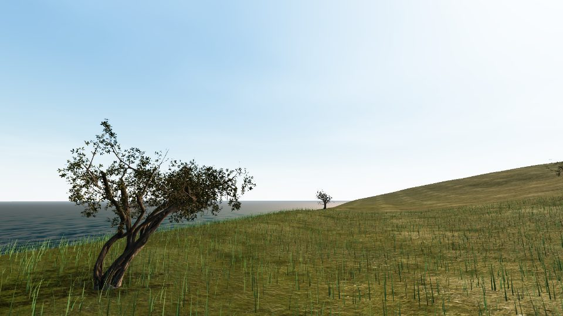

# 🍃 Çay Vadisi — Teetal am Schwarzen Meer

Ein First-Person-Farmspiel im Browser: Du führst einen kleinen Teegarten an der
türkischen Schwarzmeerküste (Karadeniz). Pflücke frische Triebe nach der echten
Regel **„iki yaprak bir tomurcuk"** (zwei Blätter, eine Knospe), verkaufe an der
Annahmestelle, kaufe bessere Ausrüstung — und repariere am Ende die alte
**Teleferik-Seilbahn**, die deinen Korb direkt ins Tal schickt.

Gebaut mit **three.js** (Vanilla, kein Framework, kein Build-Schritt).
Komplett zweisprachig: **Deutsch / Türkçe**.


| | |
| --- | --- |
|  |  |

## Spielen

Beliebigen statischen Webserver im Projektordner starten, z. B.:

```bash
python -m http.server 8137
```

Dann `http://localhost:8137` öffnen. Kein Build, keine externen CDNs —
alles liegt im Repo (offline lauffähig, direkt hostbar auf jedem Webspace).

## Steuerung

| Eingabe | Aktion |
| --- | --- |
| `W A S D` | Laufen |
| Maus | Umsehen (Klick ins Bild aktiviert Mauslock) |
| Linksklick **halten** | Tee pflücken |
| `E` | Verkaufen / Schlafen / Seilbahn nutzen |
| `Shift` | Rennen |
| `Esc` | Pause |

Touch-Geräte: Ein-Finger-Ziehen = Umsehen, Finger auf Busch halten = Pflücken,
Aktions-Prompt antippen = Benutzen.

## Spielmechanik

- **Wachstum:** Triebe sprießen über den Tag; nach **Regen** doppelt so schnell.
- **Qualität:** Frische Triebe = voller Preis (★). Wer zu lange wartet, pflückt
  überständige Blätter (weniger wert). Bei Regen gepflückt = leichter Abschlag.
- **Tagesauftrag:** Jeden Tag ein Liefer-Ziel mit Bonus.
- **Ausrüstung:** größere Körbe, Teeschere (schneller + mehr Ertrag),
  Gummistiefel, Dünger, Teleferik.
- **Saison:** 7 Tage, danach Medaille (Bronze/Silber/Gold) und Endlosmodus.
- Fortschritt wird automatisch gespeichert (`localStorage`).

## Technik

- three.js r0.185, ES-Module mit Importmap, **kein Bundler**
- Prozedurales Terrain mit analytischer Höhenfunktion (Terrassen!),
  3-Wege-PBR-Splatting (Wiese/Erde/Fels) via `onBeforeCompile`
- ~70 000 instanzierte Grashalme mit Wind-Böen im Vertex-Shader
- ~1 000 Teebüsche als 3 InstancedMeshes (Körper, Blattwolke, Trieb-Layer
  mit Per-Instanz-Wachstumsattribut)
- Physischer Himmel (three.js `Sky`) mit Tagesverlauf; Environment-Map wird
  periodisch per PMREM aus dem Himmel gebacken
- Fotogescannte CC0-Modelle (Poly Haven), selektiv dezimiert:
  Stämme ~6 %, Blattwerk ~16 % der Original-Polygone, Meshopt-komprimiert
- Meer mit dreifach gescrollten Normal-Maps + Environment-Reflexion
- Regen, Möwen, Pflück-Partikel, Tag/Nacht, dynamischer Nebel
- **Kompletter Sound prozedural per WebAudio** (Meer, Wind, Regen, Möwen,
  Pflücken, Verkauf) — keine Audiodateien, keine Lizenzfragen
- Automatische Qualitätsstufen (Gras-Dichte, Schattenauflösung, Pixel-Ratio)

## Projektstruktur

```
index.html          Einstieg + UI-Overlays
css/style.css       HUD, Menüs, Shop
js/
  main.js           Bootstrap, Loop, Qualität
  config.js         Balancing & Welt-Konstanten
  game.js           Tageszyklus, Wetter, Pflücken, Wirtschaft
  player.js         First-Person-Controller
  ui.js / i18n.js   HUD & Zweisprachigkeit (DE/TR)
  audio.js          prozedurale WebAudio-Engine
  world/            terrain, sky, ocean, grass, tea, props, rain, birds, particles
vendor/             three.js + Addons (lokal, publish-ready)
assets/             CC0-Texturen & -Modelle (siehe ASSETS.md)
tools/              Download-/Optimierungs-Skripte (nur Entwicklung)
```

## Lizenzen

Code: MIT. Assets: CC0 (Poly Haven, ambientCG) bzw. MIT (three.js,
Wasser-Normal-Map) — Details in [ASSETS.md](ASSETS.md).
